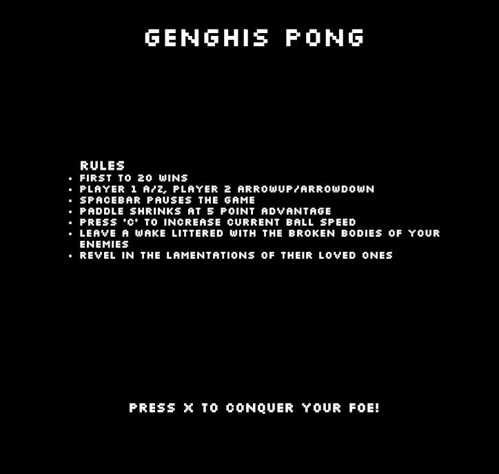
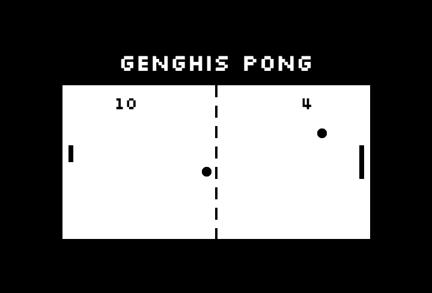

# Genghis Pong

A fast-paced, competetive arena to battle your friends on the ancient field of Pong!

## Key skills 

* Implement, export and import classes in javaScript
* Understand and demonstrate object-oriented programming style
* Create scalable vector graphics
* Deploy SVG's in a user-interactive game environment 
* Use of webkit node module to compile/minify

## Stretch goals

* Implemented static "push to start" environment with rules displayed
* Defined end-game conditions and gamestate (first to 20 points)
* Wrote balancing mechanic (paddle shrinks when a point advantage of 5 is achieved)
* Ball velocity increases on keypress until it scores a goal 
* Included complete score of intense gameplay music and satisfying victory music
* EASTER EGG: pressing the x key while the game is running will permanently increase ballspeed (may crash browser if abused)

## Setup

**Install dependencies:**

`> npm i`

**Run locally with Webpack Dev Server:**

`> npm start`

**Build for production:**

`> npm run build`

## Keys

**Player 1:**
* a: up
* z: down

**Player 2:**
* ▲ : up
* ▼: down

**Pause:**
* spaceBar

**Faster Balls:**
* C

    

   

         